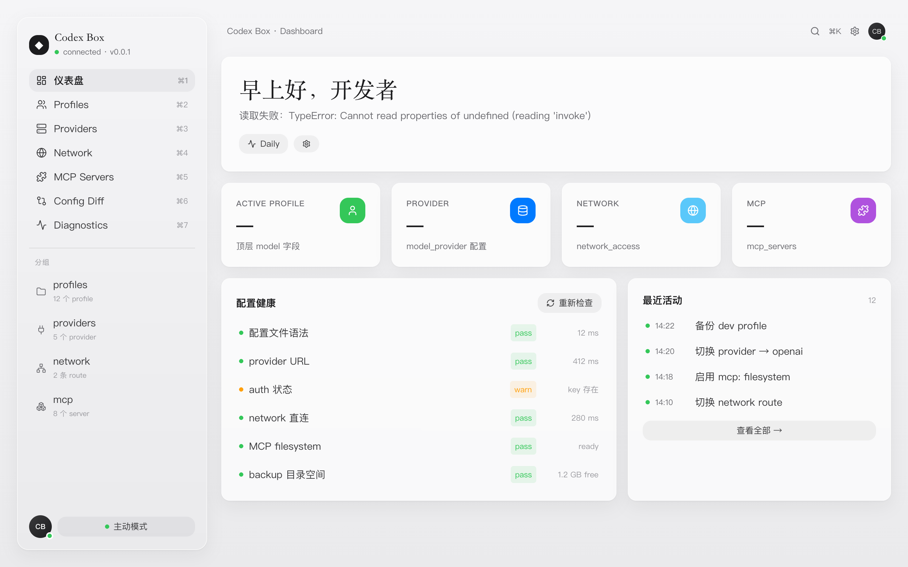

# Codex Box

> 面向 OpenAI Codex 的本地配置与网关管理器。

Codex Box 是一个使用 `Tauri + React + TypeScript + Tailwind + Rust` 构建的桌面应用，目标是把分散在 `~/.codex/config.toml`、provider、profile、MCP、network route 和 gateway preset 里的配置关系，整理成一个清晰、安全、可诊断的本地控制台。



## 设计目标

Codex Box 不是账号切换器，也不是 token 工具。它的重点是：

- 看得清：结构化展示 Codex profile、model provider、MCP server、network route 和诊断状态。
- 改得稳：所有真实配置写入都必须经过 `backup -> diff -> atomic write -> rollback` 的安全流程。
- 查得快：把 provider、network、MCP、auth、gateway 等状态集中到一个本地诊断面板。
- 接得上：为 OpenCodex、codex-proxy、CLIProxyAPI 等本地 gateway / adapter 预留清晰入口。

## 当前能力

| 模块 | 状态 | 说明 |
|---|---:|---|
| Dashboard | 可用 | 已接入基础摘要读取，展示 active profile、provider、network、MCP 和健康状态。 |
| Profiles | 前端 MVP | 支持列表、详情、当前配置、复制和危险操作确认 UI。 |
| Providers | 前端 MVP | 支持列表、详情、连接测试反馈，并可在前端新增 provider 草稿。 |
| Gateway | 前端 MVP | 支持本地 gateway preset、运行状态、host、port、日志入口和启停状态反馈。 |
| MCP Servers | 前端 MVP | 支持 server 列表、command/url、enabled 状态和测试反馈。 |
| Network | 前端 MVP | 支持 direct / HTTP proxy / SOCKS proxy / Clash route 展示和连通性测试反馈。 |
| Config Diff | 安全流程 UI | 展示写入前 diff、backup、atomic write 和 rollback 流程；当前不直接写配置。 |
| Diagnostics | 前端 MVP | 按 config、provider、gateway、MCP、backup 分组展示脱敏诊断项。 |
| i18n | 可用 | 支持中文 / English 切换，主要可见文案已进入 locale。 |

## 安全边界

Codex Box 明确不做以下事情：

- 不抓取任何账号 token。
- 不绕过 OpenAI 官方登录。
- 不规避 rate limit 或账号配额限制。
- 不默认修改 Codex Desktop 内部文件。
- 不接管系统全局代理。
- 不上传用户配置，不做团队同步 SaaS。

真实写入 `~/.codex/config.toml` 前必须满足：

1. 先创建 backup。
2. 展示 diff 并让用户确认。
3. 使用 atomic write：先写临时文件，再 rename。
4. 写入失败可 rollback 到最近一次 backup。
5. API key / token / secret 永远不写日志，不在 UI 明文展示。

## 技术栈

| 层 | 技术 |
|---|---|
| Desktop | Tauri 2 |
| Frontend | React 18 + TypeScript |
| UI | Tailwind CSS + lucide-react |
| State | zustand |
| Data fetching | TanStack Query + Tauri invoke |
| Backend | Rust |
| Config | `toml` crate + serde |
| Diff | `similar` crate |

## 项目结构

```text
.
├─ src/                         # React 前端
│  ├─ components/               # 通用组件
│  ├─ pages/                    # Dashboard / Profiles / Providers / ...
│  ├─ lib/                      # API、i18n、mock data、类型
│  ├─ store/                    # zustand stores
│  └─ styles/                   # 字体加载
├─ src-tauri/                   # Rust / Tauri 后端
│  └─ src/
│     ├─ config/                # config 读取、解析、diff、backup、writer
│     ├─ health/                # 诊断检查
│     └─ secret/                # secret 引用边界
├─ docs/
│  ├─ design/                   # UI 设计规范
│  ├─ data-model/               # 数据模型
│  ├─ decisions/                # ADR
│  └─ references/               # 参考项目技术笔记
├─ PRD.md
└─ AGENTS.md
```

## 快速开始

### 环境要求

- Node.js 18+
- pnpm
- Rust stable
- Tauri 2 所需系统依赖

### 安装依赖

```bash
pnpm install
```

### 启动前端开发服务

```bash
pnpm dev
```

默认地址：

```text
http://127.0.0.1:1420/
```

### 启动 Tauri 桌面应用

```bash
pnpm tauri:dev
```

### 构建

```bash
pnpm build
pnpm tauri:build
```

## 验证命令

```bash
pnpm exec tsc --noEmit
pnpm build
cargo test --manifest-path src-tauri/Cargo.toml
```

说明：如果只修改前端页面和文案，通常只需要跑前两条；涉及 Rust config parser、writer、diagnostics 时再跑 `cargo test`。

## OpenCodex 参考

Codex Box 会参考 OpenCodex 这类项目的 gateway / adapter 思路，但不会混用官方订阅认证，也不会抓取或复用 Codex Desktop 的账号 token。

当前参考方向：

- 本地 gateway preset 管理。
- Chat / Responses / SSE / tool calls / usage / error 的 adapter 层统一。
- Provider 与 Profile 分离建模。
- 第三方 API 通过显式 `base_url + env secret` 接入。

## 路线图

- M0：Tauri 读取 / 写入 TOML、备份、diff、atomic write 技术验证。
- M1：只读 Dashboard。
- M2：Profile + Provider MVP，含 gateway / adapter 配置底座。
- M3：Network + Diagnostics。
- M4：MCP Manager。
- M5：Gateway 体验增强，接入 CLIProxyAPI / codex-proxy 启停、日志和 preset。
- M6：桌面体验打磨，system tray、配置导入导出、历史时间线。

## License

当前仓库尚未声明 License。公开发布前建议补充明确许可证。
