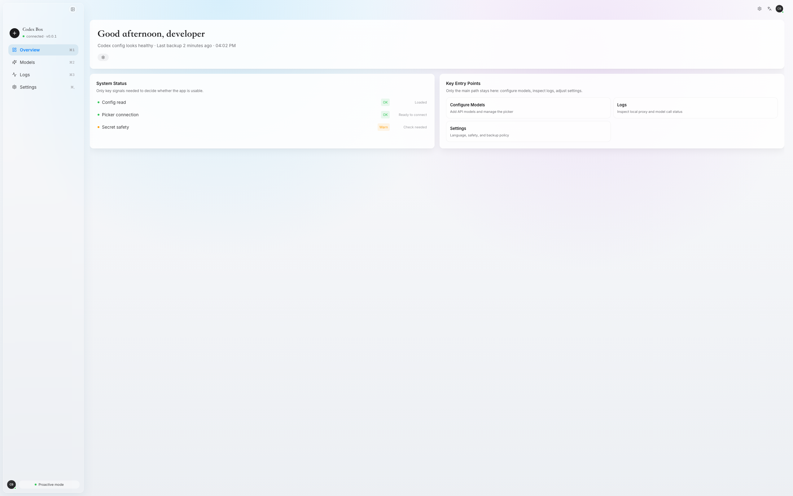

# Codex Box

> 面向 OpenAI Codex 的本地桌面控制台与 BYOK 模型下拉管理器。

Codex Box 使用 `Tauri + React + TypeScript + Tailwind + Rust` 构建，目标是通过安全管理 `~/.codex/config.toml` 与 `~/.codex/codex-box/` 下的本地配置，让 Codex Desktop / Codex CLI 可以在同一套本地工作流里使用官方订阅、OpenAI 官方 API、第三方 OpenAI-compatible API 和本地 gateway。



## 重要说明

Codex Box 的 BYOK 模型下拉和多 provider 路由在技术上可以实现：通过本地 `127.0.0.1` 代理暴露 `/v1/models`，并按模型 id 把请求转发到不同 provider。

但这不代表所有模型厂商在 Codex 里都有同等体验。Codex 对 `Responses API`、streaming events、tool calls、reasoning、vision、computer use、模型白名单和错误格式都有隐含要求；很多第三方 OpenAI-compatible 服务只是“接口形似”，在 Codex Desktop 里可能出现模型可见但调用失败、工具调用不完整、流式响应异常、reasoning 字段不兼容或上下文行为不一致等问题。

因此 Codex Box 的定位是：尽量降低配置和路由成本，提供安全回滚与诊断能力；不承诺第三方模型厂商与 Codex 官方模型完全兼容。

## 设计目标

- 看得清：展示当前 Codex config、模型目录、provider 路由、本地代理和关键诊断状态。
- 改得稳：真实写入必须经过 `backup -> diff -> confirm -> atomic write -> rollback`。
- 接得上：支持官方 API、第三方 OpenAI-compatible API、本地 gateway 与 Codex Box 自有 runtime。
- 守边界：不抓 token、不绕过登录、不 patch Codex Desktop 内部文件、不接管系统代理。

## 当前能力

| 模块 | 状态 | 说明 |
|---|---:|---|
| Overview | 可用 | 展示配置读取、picker 连接、secret 安全等关键状态。 |
| Models | 开发中 | 面向 Codex App 模型下拉，管理可见模型、provider 归属和路由关系。 |
| Local Proxy Runtime | 已落地底座 | Rust 后端提供 `127.0.0.1` 本地代理，覆盖 `/v1/models`、`/v1/responses`、`/v1/chat/completions` 等入口。 |
| Provider Routes | 已落地底座 | 通过 `~/.codex/codex-box/providers.json` 管理 provider、路由、鉴权引用和模型映射。 |
| Custom Model Catalog | 已落地底座 | 通过 `~/.codex/codex-box/custom_model_catalog.json` 管理 Codex picker 可见模型。 |
| Config 写入闭环 | 已落地底座 | 支持 backup、diff、atomic write、rollback、`content_hash` 并发校验。 |
| Logs / Diagnostics | 开发中 | 聚合本地代理、模型调用、配置检查和脱敏诊断信息。 |
| Settings | 开发中 | 管理语言、安全策略、备份策略和实验功能开关。 |

## 安全边界

Codex Box 明确不做以下事情：

- 不抓取任何账号 token。
- 不绕过 OpenAI 官方登录。
- 不规避 rate limit 或账号配额限制。
- 不默认修改 Codex Desktop 内部文件，包括 `app.asar`、renderer、IPC。
- 不接管系统全局代理。
- 不上传用户配置，不做团队同步 SaaS。
- 不复制 AITabby/opencodex 源码、UI 或长段文案。

真实写入 `~/.codex/config.toml` 前必须满足：

1. 先创建 backup。
2. 展示 diff 并让用户确认。
3. 使用 atomic write：先写临时文件，再 rename。
4. 写入失败可 rollback 到最近一次 backup。
5. API key / token / secret 永远不写日志，不在 UI 明文展示。

## 技术栈

| 层 | 技术 |
|---|---|
| Desktop | Tauri 2 |
| Frontend | React 18 + TypeScript |
| UI | Tailwind CSS + lucide-react |
| State | zustand |
| Data fetching | TanStack Query + Tauri invoke |
| Backend | Rust |
| Config | `toml` crate + serde |
| Diff | `similar` crate |
| Local proxy | axum + reqwest |

## 项目结构

```text
.
├─ src/                         # React 前端
│  ├─ components/               # 通用组件
│  ├─ pages/                    # Overview / Models / Logs / Settings
│  ├─ lib/                      # API、i18n、mock data、类型
│  ├─ store/                    # zustand stores
│  └─ styles/                   # 字体加载
├─ src-tauri/                   # Rust / Tauri 后端
│  └─ src/
│     ├─ commands/              # Tauri command 边界
│     ├─ config/                # config 读取、解析、diff、backup、writer
│     └─ proxy/                 # 本地代理 runtime
├─ docs/
│  ├─ architecture/             # 架构方案
│  ├─ design/                   # UI 设计规范
│  ├─ data-model/               # 数据模型
│  ├─ decisions/                # ADR
│  └─ references/               # 参考项目技术事实
├─ PRD.md
└─ AGENTS.md
```

## 快速开始

### 环境要求

- Node.js 18+
- pnpm
- Rust stable
- Tauri 2 所需系统依赖

### 安装依赖

```bash
pnpm install
```

### 启动前端开发服务

```bash
pnpm dev
```

默认地址：

```text
http://127.0.0.1:1420/
```

### 启动 Tauri 桌面应用

```bash
pnpm tauri:dev
```

### 构建

```bash
pnpm build
pnpm tauri:build
```

## 验证命令

```bash
pnpm exec tsc --noEmit
pnpm build
cargo test --manifest-path src-tauri/Cargo.toml
```

说明：如果只修改前端页面和文案，通常只需要跑前两条；涉及 Rust config parser、writer、proxy、diagnostics 时再跑 `cargo test`。

## 路线图

- M0：Tauri 读取 / 写入 TOML、备份、diff、atomic write 技术验证。
- M1：只读 Dashboard / Overview。
- M2：Provider / Profile MVP，写入闭环，共存迁移。
- M2.5：BYOK 模型目录与多 provider 路由底座。
- M2.6：本地代理 runtime，合并 `/v1/models`，按 model id 路由。
- M3：Models / Provider Routes / Codex Runtime 页面接真实配置。
- M4：Diagnostics / Settings 接通真实检查与配置。
- M5：桌面体验打磨，system tray、备份时间线、导入导出。

## License

当前仓库尚未声明 License。公开发布前建议补充明确许可证。
