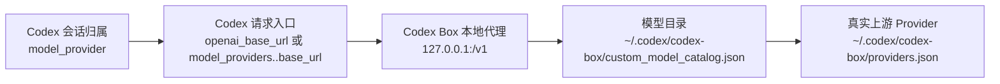

# v0.3.3 模块冲突审计：Provider / Profile / Runtime

> 日期：2026-06-26  
> 目标：解释当前“项目里有配置但 Codex App 不生效”的原因，并给出模块收敛方案。  
> 边界：只分析/修复 Codex Box 项目逻辑，不直接修改用户真实 `~/.codex/config.toml`。

## 1. 结论

当前问题不是“没有配置”，而是**配置分层没有被 UI 明确表达，且部分写入入口在写过时或错误字段**。

实际应当分成四层：



用户看到的“Provider”“模型来源”“工作配置”现在混用了不同层级：

- `model_provider`：决定 Codex 对话归属和请求入口选择；不等于真实上游。
- `openai_base_url` / `[model_providers.<id>].base_url`：决定 Codex 请求发到哪里。
- `custom_model_catalog.json` 里的 `provider` / `backend_provider`：决定模型目录里某个 model 最终路由到哪个上游。
- `providers.json`：真实上游 API base_url / API key 引用。
- “工作配置 / Profiles”：当前实现仍偏旧 profile 概念，不能作为当前 BYOK 主链路的激活入口。

所以“工作配置”和“模型来源”不是天然冲突，但**现在 UI 没有表达清楚哪个字段真正生效**，导致看起来配置齐全，实际 Codex App 没走到代理。

## 2. 当前发现的具体异常

### 2.1 `base_url` 写成了无效端口 `0`

检测到真实配置形态：

```toml
[model_providers.opencodex]
base_url = "http://127.0.0.1:0/v1"
```

`127.0.0.1:0` 不是 Codex App 可连接端口。端口 `0` 只适合服务端 bind 时让系统分配端口，不能写给客户端使用。

已修复项目侧：

- `proxy_start` / `proxy_restart` / `proxy_inject_base_url_preview` / `rewrite_base_urls` 拒绝端口 `0`。
- 前端 Runtime 页面如果代理状态端口为 `0`，预览写入默认使用 `1455`，避免继续生成 `:0`。

### 2.2 当前 Codex 请求入口未必指向本地代理

如果 `model_provider = "openai"`，Codex 请求入口应看顶层：

```toml
openai_base_url = "http://127.0.0.1:1455/v1"
```

如果使用自定义 provider，例如：

```toml
model_provider = "opencodex"

[model_providers.opencodex]
base_url = "http://127.0.0.1:1455/v1"
```

则请求入口看 `[model_providers.opencodex].base_url`。

当前 UI 之前只展示“会话归属 Provider”和“路由表”，但没有直接展示最终生效链路，因此用户会看到 proxy running，却不知道 Codex App 是否真的指向 proxy。

已修复项目侧：

- 新增 `effective_routing_status` 后端只读诊断。
- Runtime 页面新增“当前生效链路”，直接展示：
  - `model_provider`
  - 当前 `model`
  - 请求入口 `base_url`
  - 入口来源
  - `model_catalog_json`
  - catalog provider
  - `backend_provider` / `backend_model`
  - 真实上游 base_url
  - 本地代理状态和异常列表

### 2.3 “路由表模型数 = 0”显示误导

Runtime 的“路由表”来自 `~/.codex/codex-box/inject-map.json`，其中 `providers[].models` 可能为空；但真实 `/v1/models` 是从 `~/.codex/codex-box/custom_model_catalog.json` 合并出来的。

因此 UI 显示“模型数 0”并不一定代表代理没有模型。它只代表 inject-map 没记录模型列表。

后续建议：

- 路由表应改名为“注入映射 / inject-map”。
- 模型数量应从 catalog 统计，而不是从 inject-map provider 条目统计。

### 2.4 Codex Desktop renderer 可能继续过滤下拉框

参考 CCSwitchMulti 的复核结论：即使 `model_catalog_json`、provider 内联 `models`、`models_cache.json` 和 `/v1/models` 都已经包含合并模型，Codex Desktop renderer 仍可能在前端状态里按远端 Statsig 白名单过滤模型，表现为“只看到少量官方模型”。

已修复项目侧：

- 新增 `codex_desktop_integration_status` 后端只读诊断。
- 新增 `codex_desktop_picker_unlock` 显式动作：只在 Codex Desktop 已开放 CDP 时注入当前 renderer,修正 `available_models/use_hidden_models`、响应 JSON、`model/list`、`list-models-for-host` 和 React auth context 路径。
- 新增 `codex_desktop_launch_with_debugging_and_unlock` 显式动作：仅当 Codex Desktop 未运行时，用 `--remote-debugging-port` 启动 Desktop 后再注入同一套 picker patch；若 Desktop 已普通运行，则返回 `needs_quit_first`，不杀进程、不强制重启。
- Diagnostics 页面接入真实检查，不再只显示 mock 数据。
- 检查内容包括：
  - Codex Desktop 进程是否已普通启动；
  - 是否存在 `--remote-debugging-port`；
  - router provider 是否保留 `requires_openai_auth = true`；
  - `models_cache.json` 是否由 Codex Box 接管并保留 `client_version`；
  - `auth.json` 是否存在 ChatGPT 登录态结构（不读取或展示 token）。

边界：

- 诊断只解释风险，不自动启动或重启 Codex Desktop。
- 下拉框解锁必须用户显式点击；Codex Desktop 普通启动且无 CDP 时仅返回 `needs_remote_debugging` / `needs_quit_first`。
- “启动并解锁”只启动 Codex Desktop 图形应用，不启动或重启 Codex CLI / Codex CPP 终端。
- 不修改 `app.asar`、renderer 文件或 IPC。
- 不读取、不保存、不托管官方 token。

### 2.5 会话历史按 `model_provider` 分桶

真实用户现场已经出现 `openai` 与 `codex_local_access` 两个历史 bucket。表现是：同一个 Codex App、同一个项目目录下，切到 MiniMax 或自定义 provider 后，左侧会话列表和官方 GPT 会话看起来“不一样”。

这不是 MiniMax 模型本身的能力差异，而是 Codex Desktop 本地历史索引的归属字段不同：

- SQLite：`threads.model_provider`
- rollout JSONL：首行 `payload.model_provider`
- session index / global state：最近会话窗口也会受历史索引影响

已修复项目侧：

- 新增 `codex_history_reconcile` 后端只读诊断。
- 新增 `codex_history_unify_preview` / `codex_history_unify_apply` 后端命令。
- Diagnostics 页面新增“会话历史归属”分组。
- Diagnostics 页面新增“统一会话历史”工具卡，用户必须先预览再 apply。
- 诊断内容包括：
  - 当前 live `model_provider`；
  - active `state_5.sqlite` 路径与来源；
  - 所有可发现 SQLite 历史库的 provider 分布；
  - sessions / archived_sessions JSONL provider 分布；
  - 如统一到当前 provider，预计需要更新的 SQLite、JSONL、可见性索引和全局状态数量。
- apply 执行时会先备份 active SQLite、WAL/SHM、`session_index.jsonl`、`.codex-global-state.json` 和所有将被改写的 rollout JSONL。
- apply 会同步 `threads.model_provider`、rollout `payload.model_provider`、`has_user_event`、最近窗口排序、`session_index.jsonl` 缺失项和 `.codex-global-state.json` workspace hints / projectless ids / saved workspace roots。

边界：

- 不会后台自动修复；只有用户显式点击 apply 才写入。
- 默认检测到 Codex Desktop/app-server 正在运行时拒绝 apply。
- 当前 apply 仍不直接修改 Codex Desktop 内部文件，也不会在 Codex 正在运行时默认写入历史库。

## 3. 模块逐项判断

| 模块 | 当前定位 | 问题 | 处理结论 |
|---|---|---|---|
| 总览 Dashboard | 全局摘要 | 缺少“当前生效链路”摘要 | 保留，后续补链路摘要 |
| 模型配置 / Models | 管理 `custom_model_catalog.json` | 容易被误解为“激活模型”；实际只是目录 | 保留，但文案改为“模型目录”，不做隐式激活 |
| Provider 路由 | 管理 `providers.json` 真实上游 | 名字容易和 Codex `model_provider` 混淆 | 保留，建议改名“上游 API / Backend Providers” |
| Codex 运行时 | 本地代理、注入、链路诊断 | 是 BYOK 生效主入口，但之前没有展示有效链路 | 保留并作为主入口；已新增生效链路检查 |
| 会话归属 Provider | 管理 `model_provider` 与 Codex 对话列表归属 | 合理，但必须说明它不等于真实上游 | 保留，作为 Runtime 的子模块 |
| 会话历史归属诊断 | 检查 SQLite/JSONL 中的 `model_provider` 分布 | 能解释“同一模型商对话和官方对话不在一起” | 保留在 Diagnostics；后续再加显式修复入口 |
| 启用到 Codex / Inject base_url | 旧式批量改写 `[model_providers.*].base_url` | 和会话归属 provider / `openai_base_url` 方案重叠，容易误写 | 标记为高级/过渡入口，后续收敛到“应用当前链路” |
| 恢复原配置 | inject-map 还原 | 只对 inject flow 有意义 | 保留为高级恢复工具 |
| 工作配置 / Profiles | profile / sandbox / approval 管理 | 当前新 Codex profile 机制是 `$CODEX_HOME/<name>.config.toml`；旧 `[profiles.*]` 方案不应作为主线 | 暂时降级/重写，不参与 BYOK 激活主流程 |
| 诊断检查 | 健康检查 | 需要覆盖生效链路、Desktop renderer 过滤风险和官方登录态结构 | 保留，已接入 `effective_routing_status` 与 `codex_desktop_integration_status` |
| 设置 | 应用设置 | 无直接冲突 | 保留 |

## 4. 应废弃或收敛的旧入口

### 4.1 `simple_model_config_save`

问题：

- 同时写 `providers.json`、`custom_model_catalog.json`、`config.toml`，职责过重。
- 历史实现里有硬编码/过时端口倾向，容易让模型目录和 Codex 请求入口不一致。

处理建议：

- 拆成三个动作：
  1. 保存上游 API provider；
  2. 保存模型目录条目；
  3. 显式预览并应用 Codex 请求入口。
- 不再由“添加模型”隐式改 `~/.codex/config.toml`。

### 4.2 `proxy_inject_base_url_*`

问题：

- 它批量改写 `[model_providers.*].base_url`，但对于 `model_provider = "openai"` 的场景，真正入口是 `openai_base_url`。
- 它更像旧 M2.6 的注入方案，不应该和“会话归属 Provider”并列作为普通用户主入口。

处理建议：

- UI 标为“高级：批量注入/恢复”。
- 默认主入口改为“应用当前生效链路”：根据当前 `model_provider` 决定写 `openai_base_url` 还是 `[model_providers.<id>].base_url`。

### 4.3 Profiles / 工作配置

问题：

- 当前 Codex profile 机制已偏向独立 config 文件：`$CODEX_HOME/<profile>.config.toml`。
- 旧 `[profiles.*]` 容易让用户以为切了 profile 就能改变当前桌面端模型来源。

处理建议：

- 短期：标注“暂不参与 Codex Desktop 当前会话路由”。
- 中期：重写为多 config 文件管理器。
- 不再把工作配置作为 BYOK 激活路径。

## 5. 正确的主流程

用户要让 Codex App 下拉出现第三方模型，并且选中后走真实上游，应使用这条链路：

1. 在“上游 API / Backend Providers”保存真实上游：
   - `~/.codex/codex-box/providers.json`
   - API key 使用环境变量引用，不落盘。
2. 在“模型目录”保存模型条目：
   - `~/.codex/codex-box/custom_model_catalog.json`
   - 每个模型配置 `backend_provider` 和 `backend_model`。
3. 启动 Runtime 本地代理：
   - `http://127.0.0.1:1455/v1`
4. 在 Runtime 应用 Codex 请求入口：
   - `model_provider = "openai"` 时写 `openai_base_url`；
   - 自定义 `model_provider` 时写 `[model_providers.<id>].base_url`。
5. 确保 `model_catalog_json` 指向模型目录。
6. 在“当前生效链路”确认没有 fail 级异常。

## 6. 这次项目侧已完成的修复

- 后端拒绝生成或应用端口 `0` 的代理入口。
- 前端默认代理端口收敛为 `1455`，不再把状态里的 `0` 透传到写入预览。
- 新增 `effective_routing_status` 只读命令。
- 新增 `codex_desktop_integration_status` 只读命令。
- 新增 `codex_history_reconcile` 只读命令。
- 新增 `codex_history_unify_preview` / `codex_history_unify_apply`，支持备份后统一 SQLite/JSONL 历史归属，并修复会话可见性索引与全局工作区状态。
- Runtime 页面新增“当前生效链路”卡片，把真实生效路径和异常直接展示出来。
- Diagnostics 页面改为真实读取链路和 Desktop 集成状态，显示 renderer 白名单风险、models_cache 所有权、ChatGPT 登录态结构和 router provider schema。
- Diagnostics 页面新增“会话历史归属”分组，显示 SQLite/JSONL provider bucket 分布和统一预览数量。
- Diagnostics 页面新增“统一会话历史”工具卡，Codex 运行中默认禁用写入。
- 新增测试覆盖：
  - 缺少 `model_catalog_json`；
  - `127.0.0.1:0` 无效端口；
  - catalog `backend_provider` 到 `providers.json` 上游解析。
  - Codex Desktop CDP 端口解析与 Codex Box 自身进程过滤。
  - `state_5.sqlite` 与 rollout JSONL provider bucket 扫描。

## 7. 后续建议优先级

P0：修正真实用户配置时，必须由 UI 走备份 → diff → 确认 → atomic write，不允许后台直接写。  
P1：把 Runtime 的“启用到 Codex”重构成唯一主按钮“应用当前链路”。  
P1：把 Provider 路由改名为“上游 API”，减少和 `model_provider` 混淆。  
P2：Profiles 工作配置重写为 `$CODEX_HOME/<name>.config.toml` 管理。  
P2：Dashboard 接入 `effective_routing_status` 摘要；Diagnostics 已接入真实链路与 Desktop 集成检查。
